# 💫 About Me:
🎓 CTO & Co-Founder | Applied AI for Industrial Systems | PhD 🔭 Building time-series AI models for energy efficiency and reliability 🌱 I am learning more on Robotics AI and physics-informed models 💬 Ask me about manufacturing, AI, time-series, energy efficiency 👯‍♀️ I am looking to collaborate on making manufacturing sustainable 🤯 Did you know Computer was a job title - not a device! 

## 🌐 Socials:
   

# 💻 Tech Stack:
                                                

# 📊 GitHub Stats:

### ✍️ Random Dev Quote

